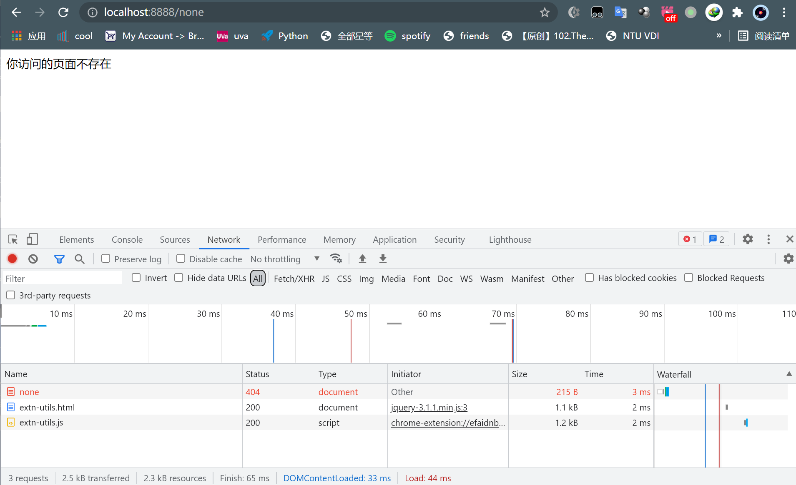

# nodejs-test


## 启动应用

`node server.js 8888`

或者

`node server 8888`

## 添加路由

1. 编辑 server.js 文件，添加 if else
2. 重新运行 node server.js 8888


## 后台启动应用
```bash
touch log
node server.js 8888 >log log 2>&1 &
```

## 页面运行成功截图
http://localhost:8888


未知路径
